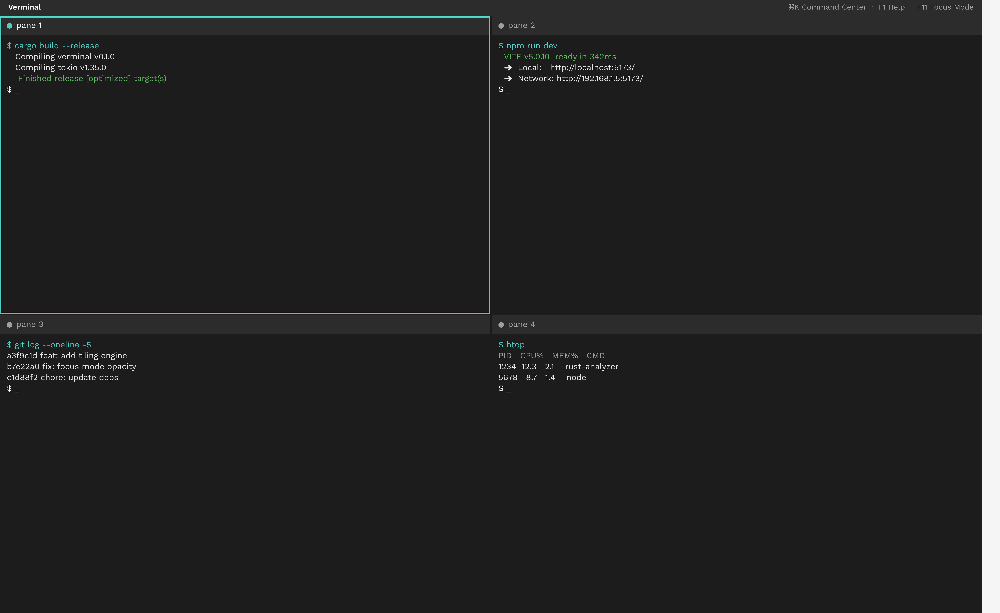
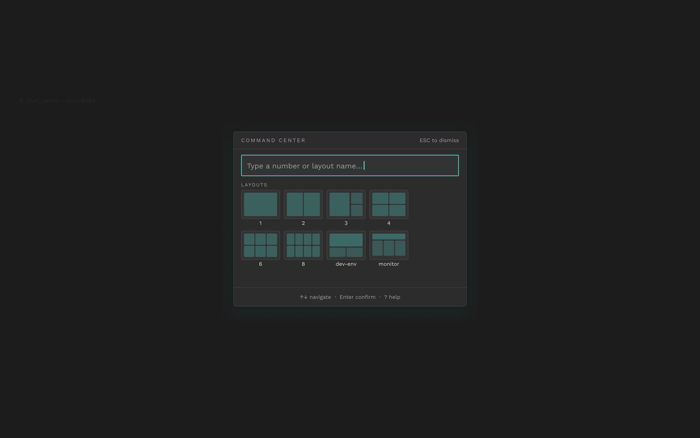
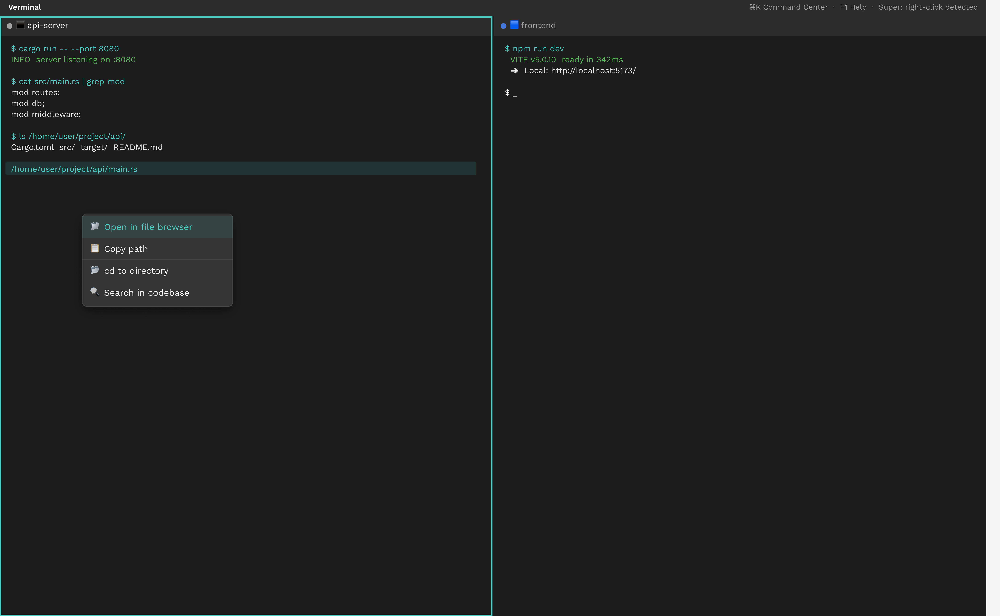
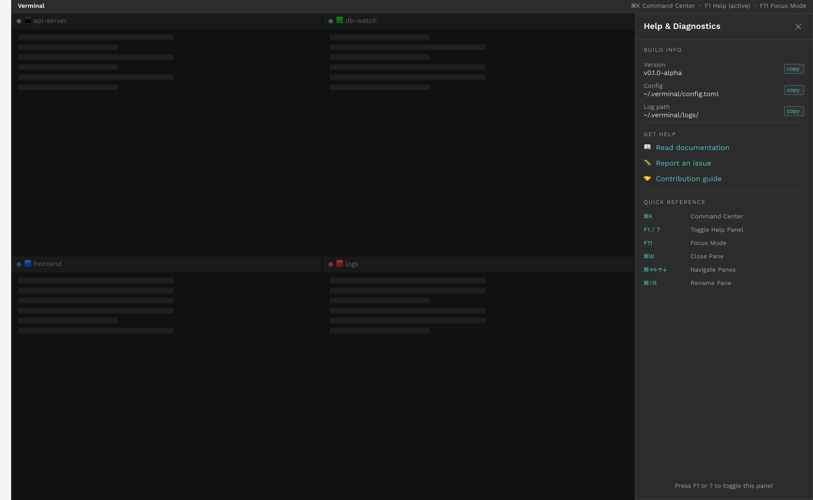

# Verminal

> Fast as vermin, fresh as spring. A tiling terminal that swarms your desktop.

Most terminal emulators treat your workspace like a grid of numbered boxes. Pane 1. Pane 2. Pane 3. It's functional, sure, but it's also forgettable. Verminal is built on a different idea: your terminal should feel like _yours_.

This isn't just another tiling terminal. It's a workspace with memory. Name your panes. Color-code them. Save layouts that remember exactly how you work. When you're deep in a project, you shouldn't be managing terminal windows. You should be _in_ _the work._



## What This Actually Does

Verminal brings three ideas together that usually live in separate tools.

**Auto-tiling that doesn't fight you.** Open one pane, you get a full terminal. Open two, they split. Three, four, they arrange themselves intelligently. No manual resizing. No remembering which window was which.

**Context awareness.** The Super Handler watches what you're doing. Click a file path in your logs? It knows. An error code? It can look that up. A URL? Open it. The terminal finally understands what you're looking at, not just what you're typing.

**Focus when you need it.** Double-click any pane header and everything else fades back. Other panes stay alive, still running, still notifying you. But your attention stays where it belongs. We call it Focus Mode. You'll call it "finally, I can think."

## The Feature Set

- **Command Center** - Hit Ctrl+Alt+T. Spawn panes, load saved layouts, navigate your entire workspace without touching the mouse.



- **Super Handler** - Right-click anything interesting. Paths, URLs, error codes. Get relevant actions without leaving your flow.



- **Focus Mode** - Double-click a pane header. Cinema mode for your terminal. Everything else dims, but stays active.
- **Pane Identity** - Name your panes. Color-tag them. Your layouts save with these identities attached, so "backend server" stays "backend server" next time.
- **Zero-Config Shell** - We detect your shell automatically. No YAML archaeology required to get started.



## Under the Hood

Verminal is built on a process-isolated architecture for security and performance:

| Layer         | Technology                                               |
| :------------ | :------------------------------------------------------- |
| Runtime       | Electron + electron-vite                                 |
| Frontend      | Svelte 5 (runes-based) + TypeScript                      |
| PTY Engine    | node-pty                                                 |
| Renderer      | @xterm/xterm + addons (WebGL, Fit, Web-links, Unicode11) |
| Styling       | Vanilla CSS                                              |
| Config        | smol-toml (deterministic TOML)                           |
| UI Components | bits-ui                                                  |

**Main process** handles PTY management, filesystem access, and OS integration. **Preload bridge** is the typed IPC boundary. **Renderer** runs the Svelte UI and owns workspace state. **Shared** contains pure types and constants used everywhere.

## Getting Started

You'll need Node.js (LTS recommended) and npm.

Install dependencies:

```bash
npm install
```

Run in development:

```bash
npm run dev
```

Build for your platform:

```bash
# Linux (primary target)
npm run build:linux

# macOS
npm run build:mac

# Windows (experimental)
npm run build:win
```

## Testing

We use Vitest for unit tests and Playwright for end-to-end coverage.

```bash
npm test
```

## Platform Support

Linux is our primary target. Ubuntu 20.04+, Debian, and Arch are fully supported. macOS 13 Ventura and newer work well on both Intel and Apple Silicon. Windows builds exist but are experimental.

## License

Apache 2.0

---

_Built for developers who spend too much time in terminals to tolerate a bad one._
